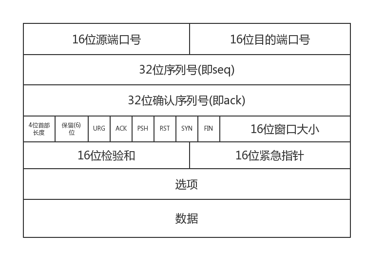

# TCP协议

## 内容概要
- 超时重传
- 拥塞控制

## TCP报文格式

- 源端口号 Source Port : 表示发送端端口
- 目标端口号 Destination Port : 表示接收端端口号
- 序列号 Sequence Number : 发送数据的位置
- 确认应答号 Acknowledgement Number : 表示已接收到 应答号减一为止的数据
- 数据偏移 Data Offset : TCP首部长度
- 保留 Reserved : 该字段主要为了以后扩展用
- 控制位 Control Flag
    - CWR : 与拥塞窗口相关
    - ECE
    - URG
    - ACK
    - PSH
    - RST
    - SYN
    - FIN
- 窗口大小 Window Size : 一次可以发送数据的大小
- 校验和 Checksum : 数据完整性校验
- 紧急指针 Urgent Pointer :

